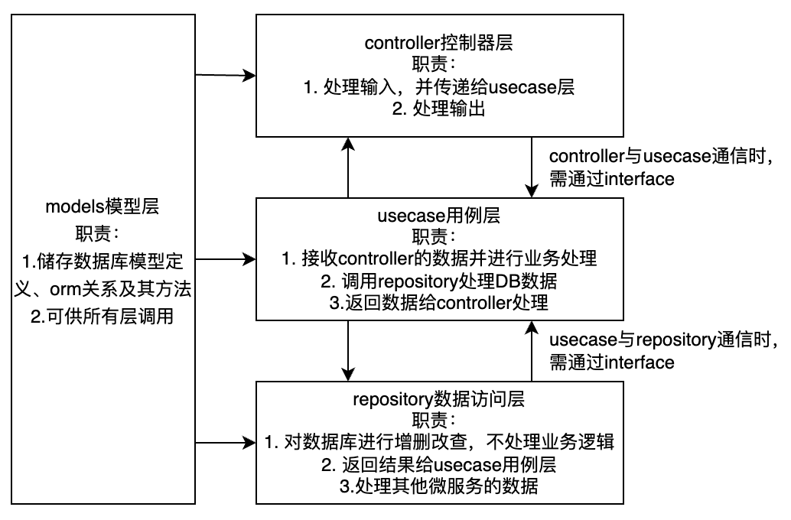

# go-basic

golang基础框架，基于gin框架

集成以下功能与特性

* 严格的目录分层
* cors跨域
* casbin权限管理
* pprof性能分析
* 统一errors和输出
* gorm
* go-redis
* logrus日志，生产环境json可供logstash导入
* cronjob定时任务
* jwt登录
* migrations数据库迁移
* 路由分层
* 支持makefile，快捷运行指令
* docker-compose一键部署
* live reload：需要安装air：`go install github.com/cosmtrek/air@latest`
* 支持MySQL、sqlite
* 支持参数validator，文档：https://pkg.go.dev/github.com/go-playground/validator/v10
* 支持golangci-lint，直接运行`make lint`即可，如果报错，需先安装golangci-lint

## 开始使用

* 把`.env.example`复制为`.env`文件，并进行配置填写

### 目录结构

* `assets` 静态文件

* `constants` 常量文件

* `controller` 控制器层文件

* `models` 模型层文件

* `utils` 工具类文件，其中`helper.go`为全局辅助函数文件

* `cronjob` 定时任务文件，语法请看：`https://github.com/robfig/cron`

* `delivery`

  - `request` 请求体定义文件，输入的结构定义可以写在此处

  - `response` 响应定义文件，输出的结构定义可以写在此处

* `errors` 错误定义文件

* `interface` 接口定义文件

* `migrations` 数据库迁移文件（需安装goose: `go install github.com/pressly/goose/v3/cmd/goose@latest`）

* `proto` protobuf文件

* `repository` 数据访问层文件

* `routes` 路由文件，可以有多个路由文件，新增时，在`router.go`文件中注册

* `service` 服务层，提供各种服务

* `usecase` 用例层文件

### 分层说明



各层通信时，必须通过interface，例如：user控制器调用`usecase`中的`GetGender`方法，就在`interface/usecase`文件夹下新建一个`user_usecase`:

```
package usecase

type UserUseCase interface {
	GetGender(userId int) (int, error)
}
```

同理，`UserUseCase`调用`repository`中的`GetProfile`时，也需要在`interface/repository`文件夹下新建一个`user_repository`:

```
package usecase

type UserRepository interface {
	GetProfile(userId int) (*model.User, error)
}
```

### 其他使用说明

* 新增环境变量`KEY`，可以在`.env`文件中加`KEY=value`，获取其值用`os.Getenv(KEY)`
* 使用jwt：在路由文件中新增：`r.Use(middleware.AuthMiddleware)`，生成jwt token用`service.GenerateToken(UID)`，前端请求头必须是：`Authorization: Bearer TOKEN`这种标准格式
* 在控制器中获取用户ID可以用`userId, _ := c.Get("UID")`
* 怎么写错误代码：可以参照`errors/auth.go`文件的写法
* 控制器返回数据用`response.Success`或者`response.Fail`方法，如：`response.Success(c, "Hello World")`、`response.Fail(c, errors.EMPTY_TOKEN)`，记得return
* pprof使用方法请看：https://github.com/gin-contrib/pprof#use-the-pprof-tool
* casbin权限管理文件在`assets/casbin`目录下，如果要启用，可以在路由文件`web.go`中添加：`r.Use(middleware.NewCasbinMiddleware())`，用了casbin的中间件，就不需要`AuthMiddleware`了
  - model语法看：https://casbin.org/zh/docs/syntax-for-models
  - policy语法看：https://casbin.org/zh/docs/policy-storage（policy第二个参数是用户ID）
* 参数校验写法例子：
```
    //如果是验证struct
    var loginReq request.LoginRequest
	if err := c.BindJSON(&loginReq); err != nil {
		response.Fail(c, err)
	}
	e := service.Validate(loginReq)
	if e != nil {
		response.Fail(c, e)
		return
	}
	//如果是验证单个string
	myEmail := "example.gmail.com"
	err := service.Validate(myEmail, "required,email")
	if err != nil {
		response.Fail(c, err)
		return
	}
```

### 代码规范

除了上述一些目录规范，还有以下规范需要注意

* 